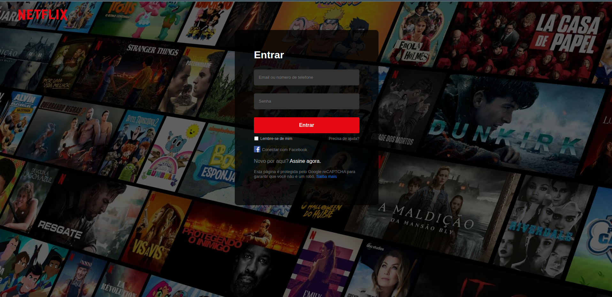

# 🎬 Netflix Login Page

Uma recriação da interface de login da **Netflix**, desenvolvida com **HTML e CSS**, com foco em praticar conceitos de desenvolvimento Front-End, estruturação de páginas e criação de interfaces modernas e responsivas.

## 📸 Preview



## 🚀 Sobre o projeto

Este projeto foi desenvolvido como um exercício prático de **Front-End**, inspirado na interface de login da Netflix.

O objetivo principal foi reproduzir a aparência e a experiência visual da página, trabalhando conceitos como:

* Estruturação semântica com HTML5
* Estilização e layout com CSS3
* Responsividade
* Posicionamento e alinhamento de elementos
* Formulários e campos de entrada
* Tipografia e hierarquia visual
* Uso de imagens e elementos de interface

## 🛠️ Tecnologias utilizadas

* **HTML5**
* **CSS3**

## 📂 Estrutura do projeto

```text
Tela_de_login_da_Netflix/
│
├── assets/
│   └── netflix-login.png
│
├── Tela de login da Netflix/
│   ├── index.html
│   └── style.css
│
├── .gitattributes
├── LICENSE
└── README.md
```

## 💻 Como executar

Clone o repositório:

```bash
git clone https://github.com/nongoantonio/Tela_de_login_da_Netflix.git
```

Entre na pasta:

```bash
cd Tela_de_login_da_Netflix
```

Depois, abra o arquivo `index.html` no navegador.

Você também pode utilizar a extensão **Live Server** no Visual Studio Code para executar o projeto localmente.

## 🎯 Objetivos

Este projeto teve como principais objetivos:

* Praticar HTML e CSS;
* Melhorar a construção de layouts;
* Desenvolver interfaces visualmente fiéis a referências;
* Trabalhar responsividade;
* Aperfeiçoar habilidades de desenvolvimento Front-End.

## ⚠️ Aviso

Este é um projeto **educacional e não oficial**, desenvolvido apenas para fins de estudo e prática de desenvolvimento Front-End.

Netflix é uma marca registrada de seus respectivos proprietários. Este projeto não possui qualquer vínculo oficial com a Netflix.

## 👨‍💻 Autor

**Nongo Antonio**

Desenvolvedor Front-End em formação, interessado em criar interfaces modernas, responsivas e experiências digitais intuitivas.

---

⭐ Se este projeto foi útil para você, considere deixar uma estrela no repositório!

